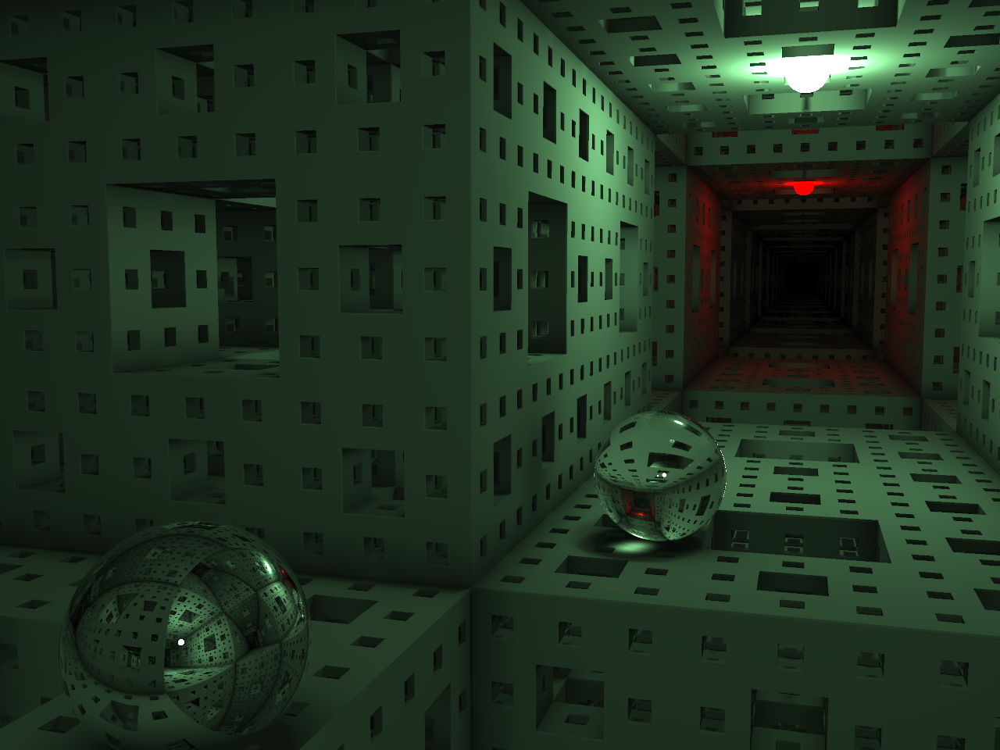

# 月灯(tsukihi)
距離関数によって表現されたオブジェクトをレイマーチングでレンダリングするレンダラーです。
パストレーシングによるレンダラーの実装と擬似表現によるレンダラーの両方の実装があります。

[レイトレ合宿4](https://sites.google.com/site/raytracingcamp4/)への参加作品です。

サンプル出力した画像です。

## 紹介スライド
[tsukihiができるまで #レイトレ合宿4](https://speakerdeck.com/gam0022/tsukihigadekirumade-number-reitorehe-su-4)

## License
Copyright (c) 2016 gam0022

This software is released under the MIT License (http://opensource.org/licenses/mit-license.php).

A part of this software is based on edupt (https://github.com/githole/edupt) and smallpt (http://www.kevinbeason.com/smallpt/)
